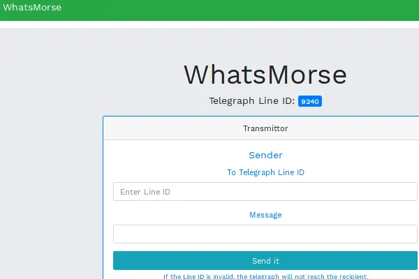

<div align="center">
    <h1>WhatsMorse</h1>
    <p>A morse-code instant messenger</p>
</div>

[](https://builtwithnix.org)
[](https://codespaces.new/humaidq/whatsmorse)
[](https://goreportcard.com/report/github.com/humaidq/whatsmorse)

## Description



WhatsMorse is a web messaging application which translates all your messages to
morse code written in a two hour ["Stupid" Hackathon by
Transcend](https://www.meetup.com/transcenddubai/events/245505285/) in January
of 2018.

The goal of the hackathon was to create something useless (can be anything, not
limited to computer software).

## Usage

This project includes a [Nix] development shell, which pulls in the required
version of Go. It also includes the application as a Nix package.

### With Nix (recommended)

To run the application:

```
PORT=8080 nix run
```

To load a development shell:

```
nix develop
```

The development shell would automatically be loaded if you have [nix-direnv]
configured on your machine.

### With Dev Containers

You may use dev containers with this project. You can use it on your local
editor, or open this project in GitHub Codespaces. Please note that GitHub may
bill you for using this feature.

### Using Go

Make sure you have Go installed on your system.

To build & run the application:

```
go build
PORT=8080 ./whatsmorse
```

[Nix]: https://zero-to-nix.com/start/install)
[nix-direnv]: https://github.com/nix-community/nix-direnv
